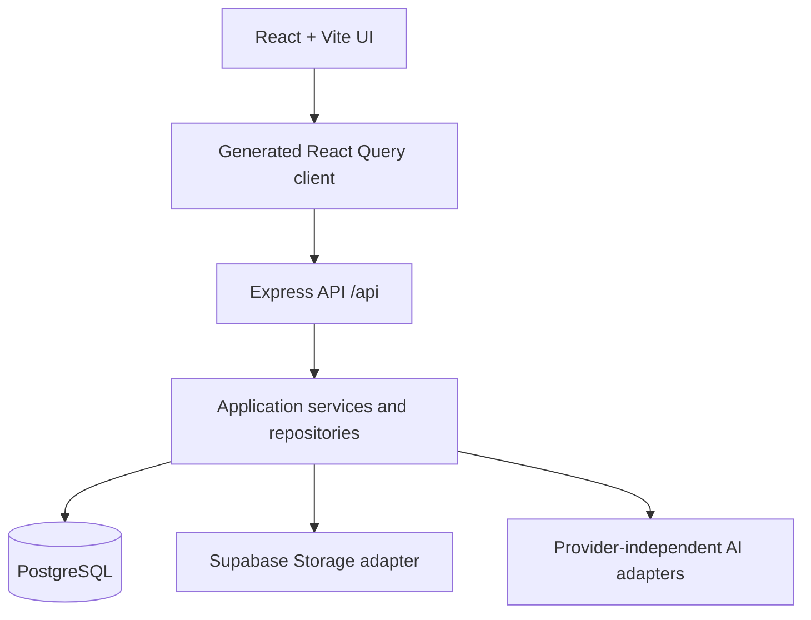

# KarigarAI

KarigarAI is a mobile-first business manager for marginalized Indian artisans,
weavers, handicraft makers, and micro-entrepreneurs. It is designed for
Smart India Hackathon 2026 problem SIH26090: AI-driven market linkage and
smart cataloging for handmade India.

## Phase 1 foundation

The first phase establishes the portable application foundation:

- React + Vite frontend with shared routing and a mobile-first design system
- Express API with OpenAPI-first contracts and generated React Query/Zod clients
- PostgreSQL schema for profiles, roles, artisans, products, images, pricing,
  inquiries, messages, categories, market references, notifications, analytics,
  and AI processing logs
- deterministic demo seed data for Savitri Devi and six published products
- foundation status, category, marketplace discovery, and demo overview APIs
- English/Hindi/Telugu language metadata ready for the shared i18n layer
- storage bucket naming foundation for originals, enhanced images, profiles, and
  voice recordings

The artisan photo, image enhancement, voice, catalog, pricing, review, publish,
inquiry, and notification workflows are intentionally reserved for later phases.

## Run

```bash
pnpm install
pnpm --filter @workspace/api-server run dev
pnpm --filter @workspace/karigarai run dev
```

The API is served under `/api` and the web app is served at `/`.

## Architecture



Supabase Auth, Supabase Storage, and production provider adapters remain
configuration-ready until their external project connection is added. The
development foundation uses the preconfigured PostgreSQL database so the app
can be run and verified without inventing credentials or silently substituting
local authentication.